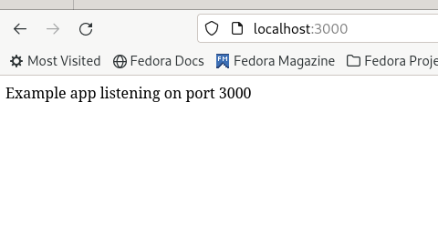

# Цель работы
Написать 2 Dockerfile с примерами bad practices и best practices.

# Хороший Dockerfile 

1. В хорошем докер файле указывается не latest версия, а конкретная, поскольку в первом случае со релизами новых версий могут происходить ошибки.
Поэтому здесь прописано ```FROM node:20-alpine```

2. Для того, чтобы не запускать команды, каждый раз используя RUN, и чтобы исключить проблемы с кэшем, мы используем RUN только один раз, перечисляя
команды через && \

3. Для entrypoint команды мы специально используем CMD, а не пишем команду "node app.js" в разделе RUN



# Плохой Dockerfile 

1. Здесь указывается latest версия - может привести к ошибкам!

2. Несколько команд RUN

3. Не указаны настройки ENV для дальнейшей работы с mongo (можно сделать в docker-compose, но иногда удобнее их указать здесь)

# Плохие практики при работе с контейнером

1. Не стоит менять строки внутри Dockerfile образа, на базе которого вы собираетесь запускать контейнер, т. к. нарушится последовательность слоев и последующие изменения образа могут повлечь за собой более длительный процесс сборки.

2. При запуске контейнера нельзя не прописывать порты. Необходимо при запуске контейнеров на основе данного образа маппить порты с системы внутрь контейнера.

# Вывод

В ходе лабораторной работы мы написали 2 Dockerfile, которые содержат в себе примеры хорошей и плохой практик использования.