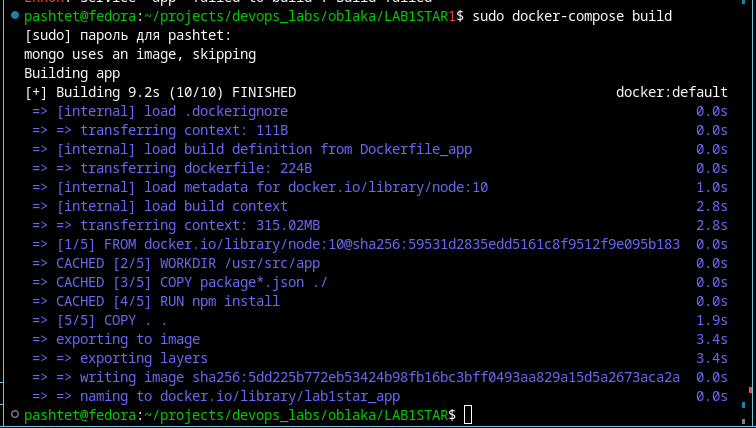

# Цель работы
Написать образ, запускающий приложение в контейнере, которое должно записывать изменения в базу данных.

# Ход работы
1. Сначала было написано приложение на Node.js, которое использует библиотеки express, body-parser и mongodb для запуска сервера и записи данных в базу данных MongoDB

2. Далее написан Dockerfile_app - файл для сборки Docker-образа
3. Написан docker-compose.yml - файл для запуска контейнера и базы данных (MongoDB в данном случае)
4. Написан файл start-container.sh для удобного запуска контейнера с передачей данных для записи в базу данных

# Вывод по работе 
В ходе выполнения лабораторной работы был написан образ и docker-compose.yml, запускающий приложение в контейнере, которое записывает изменения в базу данных.