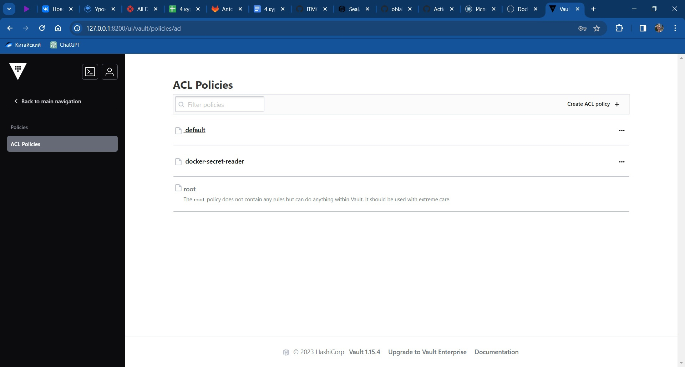

# Лабораторная работа №3*

## Цель работы *
Сделать красиво работу с секретами. Например, поднять Hashicorp Vault и сделать так, чтобы ci/cd пайплайн ходил туда, брал секрет, использовал его не светя в логах

## Выполнение *
Для красивого хранения секретов было решено использовать Hashicorp Vault

### Настройка Hashicorp Vault
*В какой-то момент я запутался в количестве "терминалов" поэтому решил запустить счётчик и указывать какой конкретно я запускал*

Для запуска сервера локально нужно выполнить команду в командной строке Windows

```bat
vault server -dev -dev-root-token-id root
```
*Счётчик открытых терминалов: __1__*

### Создание секретов
Нужно открыть второй терминал, на этот раз bash

*Счётчик открытых терминалов: __2__*

В нём нужно запустить команду

```bash
# set env vars
export VAULT_ADDR=http://127.0.0.1:8200
export VAULT_TOKEN=root

# save secrets
/c/Users/kolay/Downloads/vault_1.15.4_windows_amd64/vault kv put secret/docker DOCKERHUB_USERNAME=kolayandr DOCKERHUB_ACCESS_TOKEN=dckr_pat_YKk_Z_pbXsCR7HlhPueErwS95W4

# create policy to read secret
/c/Users/kolay/Downloads/vault_1.15.4_windows_amd64/vault policy write docker-secret-reader - <<EOF
path "secret/data/docker" {
    capabilities = ["read"]
}
EOF

# create env var with policy token
GITHUB_REPO_TOKEN=$(/c/Users/kolay/Downloads/vault_1.15.4_windows_amd64/vault token create -policy=docker-secret-reader -format json | /c/Users/kolay/Downloads/vault_1.15.4_windows_amd64/jq -r ".auth.client_token")

# test: getting token via policy token
VAULT_TOKEN=$GITHUB_REPO_TOKEN /c/Users/kolay/Downloads/vault_1.15.4_windows_amd64/vault kv get secret/docker
```

Для проверки можно посмотреть секреты в интерфейсе Vault через браузер по адресу VAULT_ADDR=http://127.0.0.1:8200




### Создание Self-host runner в GitHub
Наш Vault был запущен локально, поэтому нужно, чтобы Actions GitHub'а тоже запускались локально, поэтому был создан и настроен self-hosted runner. Для создания его можно воспользоваться настройками Git, в которых будут представлены необходимые команды

Запускать команды нужно через PowerShell, а значит... *Счётчик открытых терминалов: __3__*


### Настройка workflow
Из базовой лабораторной нужно переработать yml

Нужно также создать дополнительный секрет под названием VAULT_TOKEN со значением DOCKER_READ_WRITE_TOKEN

```yml
name: Docker Autobuild, Autopush and Autobot*

on:
  workflow_dispatch: 

jobs:
  build_and_push: 
    runs-on: self-hosted

    defaults:
      run:
        working-directory: "/lab3*"

    steps:
      - name: Checkout repository
        uses: actions/checkout@v4

      - name: Import Secrets
        uses: hashicorp/vault-action@v2.4.0
        with:
          url: http://127.0.0.1:8200
          tlsSkipVerify: true
          token: ${{ secrets.VAULT_TOKEN }}
          secrets: |
            secret/data/docker DOCKER_USERNAME ;
            secret/data/docker DOCKER_READ_WRITE_TOKEN

      - name: Login to Docker Hub
        uses: docker/login-action@v3
        with:
          username: ${{ env.DOCKER_USERNAME }}
          password: ${{ env.DOCKER_READ_WRITE_TOKEN }}

      - name: Build and push to Docker hub
        uses: docker/build-push-action@v5
        with:
          context: ./lab3
          push: true
          tags: kolayandr/oblaka:latest
```

Рассмотрим изменения более детально

#### Запуск только по кнопке

В триггерах action был оставлен только ручной запуск, так как для работы этого action нужно, чтобы был локально запущен vault.

#### Импорт секретов

[Vault-action](https://github.com/marketplace/actions/hashicorp-vault) используется для импорта секретов в виде переменных среды.
1. Указываем url, на котором запущен Vault: `http://127.0.0.1:8200`.
2. Указываем токен, сохранённый в GH secrets `secrets.VAULT_TOKEN`.
3. Указываем, что необходимо импортировать секреты `DOCKER_USERNAME` и `DOCKER_READ_WRITE_TOKEN`.

```yml
- name: Import Secrets
  uses: hashicorp/vault-action@v2.4.0
  with:
    url: http://127.0.0.1:8200
    tlsSkipVerify: true
    token: ${{ secrets.VAULT_TOKEN }}
    secrets: |
      secret/data/docker DOCKER_USERNAME ;
      secret/data/docker DOCKER_READ_WRITE_TOKEN
```

#### Авторизация в DockerHub

Скорректируем авторизацию в DockerHub. Теперь секреты берём не из GH Secrets, а из переменных среды, куда они были помещены на предыдущем шаге.

```yml
- name: Login to Docker Hub
  uses: docker/login-action@v3
  with:
    username: ${{ env.DOCKER_USERNAME }}
    password: ${{ env.DOCKER_READ_WRITE_TOKEN }}
```

### Запуск workflow
Для начала необходимо запустить раннер локально

С помощью кнопки в GitHub Actions можно запустить workflow

## Заключение
С помощью [HashiCorp Vault](https://www.vaultproject.io/) и self-hosted runner было настроено безопасное использование секретов в GitHub Actions. Также было подсчитано количество открытых терминалов, количество достигло трёх
