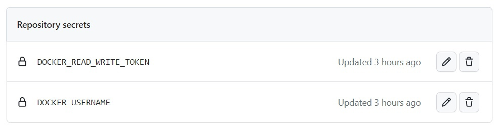

# Лабораторная работа №3

## Docker Autobuild, Autopush и Autobot
Этот файл GitHub Actions предназначен для автоматизации процесса создания Docker-образа, его публикации в Docker Hub и обеспечения бесперебойной интеграции в ваш рабочий процесс разработки

## Цель работы
Сделать так, чтобы после push'а в папку lab3 ветки main репозитория автоматически собирался docker образ, который должен быть сохранен в Docker Hub
## Цель работы* 
Сделать красиво работу с секретами. Например, поднять Hashicorp Vault и сделать так, чтобы ci/cd пайплайн ходил туда, брал секрет, использовал его не светя в логах

## Выполнение и выполнение*
Для выполнение было решено использовать GitHub Actions. Для соблюдения дополнительного условия было решено пользоваться возможностями GitHub Action Secrets, в котором заранее были сохранены переменные DOCKER_USERNAME и DOCKER_READ_WRITE_TOKEN



Для настройки GitHub Actions необходимо создать `.yml` файл в директории `.github/workflows/`

## Содержание файла lab3.yml

```yml
name: Docker Autobuild, Autopush and Autobot

on:
  push:
    branches: [ "main" ]
    paths:
      - "lab3/**"
      - ".github/workflows/**"
  workflow_dispatch:

jobs:
  build-and-push:
    runs-on: ubuntu-latest

    defaults:
      run:
        working-directory: "/lab3"

    steps:
    - name: repository checkout
      uses: actions/checkout@v4


    - name: login to docker
      uses: docker/login-action@v3
      with:
        username: ${{ secrets.DOCKER_USERNAME }}
        password: ${{ secrets.DOCKER_READ_WRITE_TOKEN }}

    - name: build-push-docker
      uses: docker/build-push-action@v5
      with:
        context: ./lab3
        push: true
        tags: KolaYAndr/oblaka:latest
```

## Препарируем файл по частям

### Настройка условий запуска и присвоение имени

```yml
name: Docker Autobuild, Autopush and Autobot

on:
  push:
    branches: [ "main" ]
    paths:
      - "lab3/**"
      - ".github/workflows/**"
  workflow_dispatch:
```

С помощью `name` укажем название сценария. Это название будет отображаться в разделе Actions. С помощью `on` прописываются правила для запуска сценария

В нашем случае будет два правила:
1. Правило на автозапуск после push в ветку `main`. Причём дополнительно пропишем, что сценарий надо запускать только если изменились файлы в директории третьей лабораторной работы или директории с настройками workflow
2. С помощью `workflow_dispatch` добавим возможность запускать сценарий через интерфейс github

### Шаги выполнения
Checkout извлекает репозиторий, благодаря этому остальная часть сценария получает к нему доступ
```yml
    - name: repository checkout
      uses: actions/checkout@v4
```

Авторизация в Docker через секреты GitHub'а
```yml
- name: login to docker
      uses: docker/login-action@v3
      with:
        username: ${{ secrets.DOCKER_USERNAME }}
        password: ${{ secrets.DOCKER_READ_WRITE_TOKEN }}
```

Создание и отправка образа
```yml
- name: build-push-docker
      uses: docker/build-push-action@v5
      with:
        context: ./lab3
        push: true
        tags: KolaYAndr/oblaka:latest
```

## Доказательство работоспособности
Успешное прохождение процесса во вкладке Action (с 11 раза получилось)


Скриншот загрузки изображения в DockerHub


Ссылка на DockerHub: https://hub.docker.com/repository/docker/kolayandr/oblaka/general

## Вывод
В ходе выполнения лабораторной работы был настроен CI/CD workflow для автоматической сборки и публикации Docker образа при выполнении push в репозиторий. Проведены тесты работоспособности созданного workflow. И проделана красивая работа с секретами
