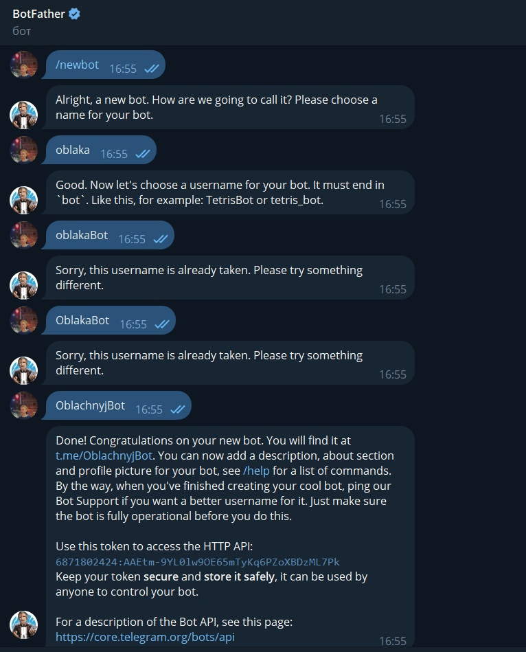
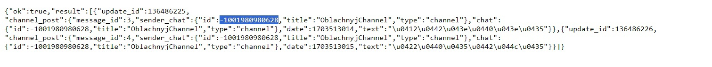

# Лабораторная работа 4 *

## Цель работы *
Настроить алерт кодом (не в интерфейсе графаны:), показать пример его срабатывания.Попробовать сделать так, чтобы он приходил, например, на почту или в телеграм. Eсли не получится - показать имеющийся результат и аргументировать, почему дальше невозможно реализовать.

## Выполнение *
Для удобства было принято решение о переустановке Prometheus, AlertManager и Stats с репозиториев

https://github.com/techiescamp/kubernetes-prometheus - Prometheus

https://github.com/bibinwilson/kubernetes-alert-manager.git - AlertManager

clone https://github.com/devopscube/kube-state-metrics-configs.git - Stats

### Обустройство среды для телеграм
Через @BotFather создали бота. Самое сложное было выбрать незанятый ник

После нужно было создать канал, в который бот был добавлен как администратор, и куда в дальнейшем будет отправлять сообщения. Но для этого нужно узнать id чата, поэтому в чат было отправлено сообщение. И перейдя по ссылке https://api.telegram.org/bot6871802424:AAEtm-9YL0lw9OE65mTyKq6PZoXBDzML7Pk/getUpdates, узнаём id чата

Для телеги всё готово

### Изменяем файлы AlertManager'а
