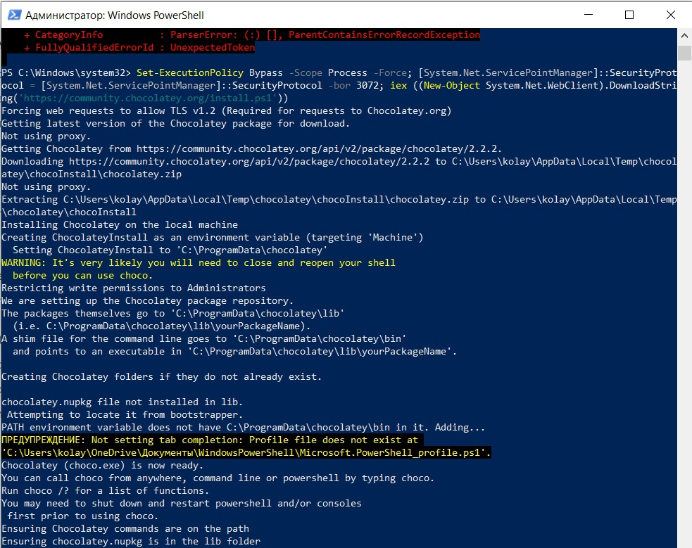
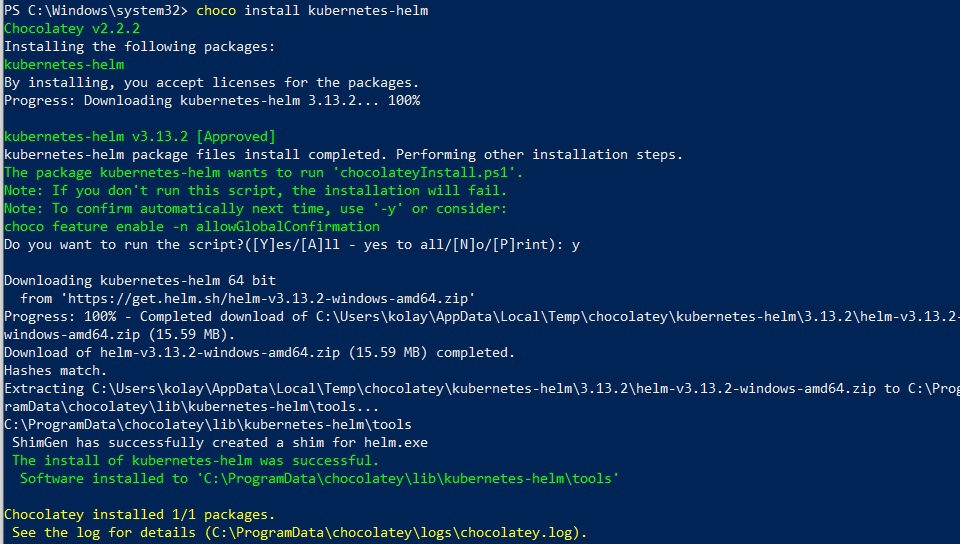
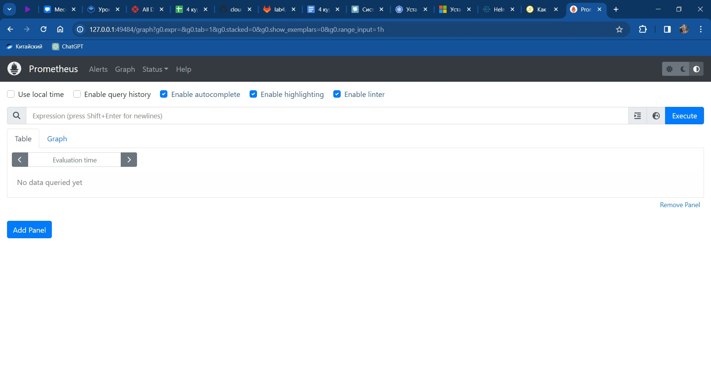
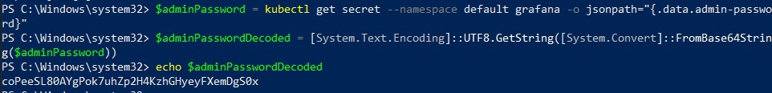
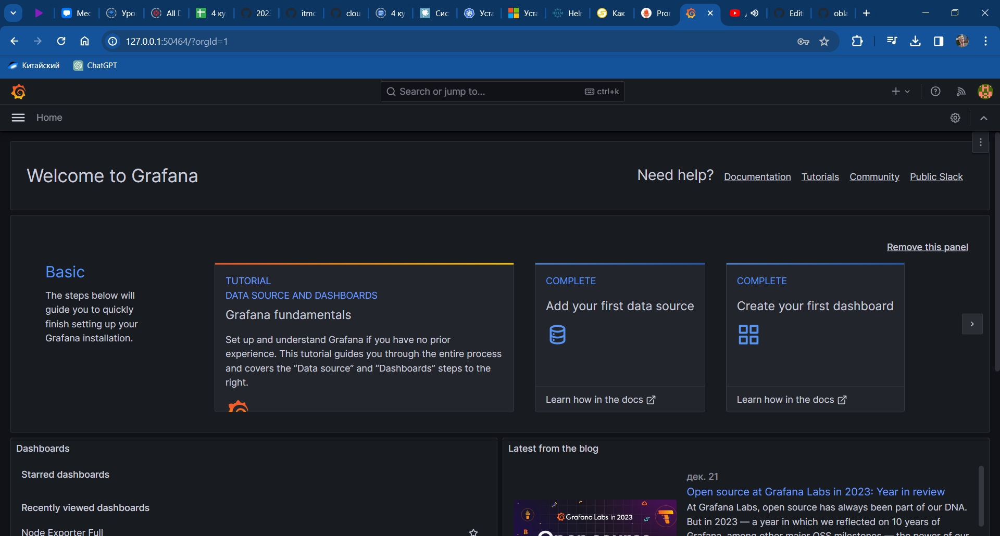
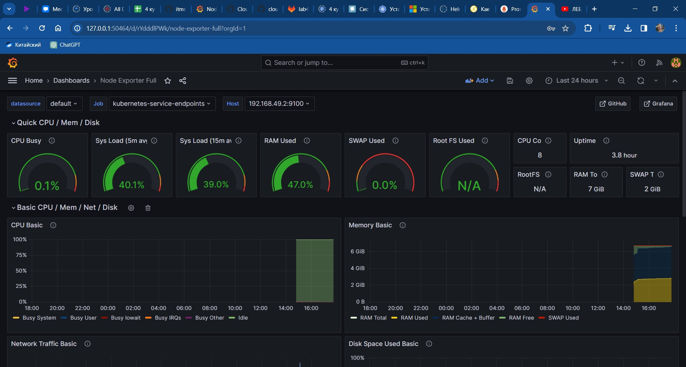

# Лабораторная работа №4

## Цель работы
Сделать мониторинг сервиса, поднятого в кубере (использовать, например, prometheus и grafana). Показать хотя бы два рабочих графика, которые будут отражать состояние системы

## Выполнение
Для начала нужно скачать Prometheus и Grafana

Проблемы начинаются уже здесь, поскольку для установки нужно скачать Helm Charts, а для установки его нужно поставить Chocolately

### Установка Chocolately и Helm Charts
Вот такими командами в терминале PowerShell проблема решается

```powershell
Set-ExecutionPolicy Bypass -Scope Process -Force; [System.Net.ServicePointManager]::SecurityProtocol = [System.Net.ServicePointManager]::SecurityProtocol -bor 3072; iex ((New-Object System.Net.WebClient).DownloadString('https://community.chocolatey.org/install.ps1'))
```



Теперь, когда у нас установлен Chocolately нужно через него поставить Helm

В этом нам поможет команда

```powershell
choco install kubernetes-helm
```



Ву-а-ля и проблемы решены. Дальше можно устанавливать Prometheus и Grafana

### Установка Prometheus
Для этого в терминале PowerShell выполняем следующие команды
```powershell
helm repo add prometheus-community https://prometheus-community.github.io/helm-charts
```
```powershell
helm install prometheus prometheus-community/prometheus
```
```powershell
kubectl expose service prometheus-server --type=NodePort --target-port=9090 --name=prometheus-server-np
```

Теперь выполним команду 
```powershell
minikube service prometheus-server-np
```

И в браузере откроется страница интерфейса Prometheus




### Установка Grafana
Она происходит аналогично установке Prometheus через следующие команды

```powershell
helm repo add grafana https://grafana.github.io/helm-charts
```
```powershell
helm install grafana grafana/grafana
```
```powershell
kubectl expose service grafana --type=NodePort --target-port=3000 --name=grafana-np
```

Теперь выполним команду 
```powershell
 minikube service grafana-np
```

Дальше необходимо получить пароль для входа, логин нам известен - admin. В официальной документации предлагается использовать base64, но на Windows не получится, поэтому приходится пользоваться альтернативными путями

```powershell
 $adminPassword = kubectl get secret --namespace default grafana -o jsonpath="{.data.admin-password}"
 $adminPasswordDecoded = [System.Text.Encoding]::UTF8.GetString([System.Convert]::FromBase64String($adminPassword))
 echo $adminPasswordDecoded
```

Эти команды выведут нам пароль для входа



И также откроется интерфейс Grafana



### Настройка Dashbord'ов
Для отображения нужно добавить наш Prometheus в интерфейсе Grafana. Для этого перейдём в Connections в боковом меню, а дальше в Data sources. Далее в Add data source, выберем Prometheus. Укажем порт, на котором держится Prometheus и добавим необходимую графику, можно использовать [библиотеку](https://grafana.com/grafana/dashboards/)

## Вывод
Был успешно настроен мониторинг сервиса, запущенного в Kubernetes, с использованием Prometheus и Grafana. Было настроено отображение графиков для отслеживания нагрузки


